--> Customer Rewards Program

A React application that calculates and displays customer reward points based on purchase transactions over a three-month period.

--> Features

Rewards Calculation: Automatically calculates points based on transaction amounts
Monthly & Total Summaries: Dispoints points earned per month and total per customer
Transaction History: Shows detailed transaction records with calculated points
Responsive Design: Works on desktop, tablet, and mobile devices
Error Handling: Graceful error handling with retry functionality
Loading States: Professional loading indicators during data fetching

--> Reward Calculation Logic

The application uses the following points calculation rules:
2 points for every dollar spent over $100
1 point** for every dollar spent between $50 and $100
0 points for every dollar spent below $50

Examples:
--> $120 purchase = 2×$20 + 1×$50 = 90 points
--> $75 purchase = 1×$25 = 25 points
--> $49 purchase = 0 points

Decimal Handling: Amounts are floored before calculation (e.g., $100.99 → $100 → 50 points)

--> Technical Approach

--> Architecture
Component-Based Architecture: Modular React components with clear separation of concerns
Pure Functions: All business logic implemented as pure, testable functions
Mock API Layer: Simulated asynchronous API calls with proper error handling
Functional Programming: Used `map`, `reduce`, and `filter` instead of imperative loops

--> Key Design Decisions
No External State Management: Used React hooks instead of Redux as required
Type Safety: Implemented PropTypes for all component props
Error Boundaries: Comprehensive error handling throughout the application
Performance: Optimized re-renders with proper dependency management
Testing: Comprehensive test coverage for core business logic

--> Installation and Setup
1. Clone the repository
VS code -> View -> Command Palette -> Git clone -> [https://github.com/lahari160/rewards-app.git](https://github.com/lahari160/rewards-app.git)

2. cd rewards-app

3. npm install

4. To start development server -> npm start

5. For Test Cases npm test -- --watchAll

6. Run tests with coverage flag  npm test -- --coverage // npm test -- --coverage --watchAll=false

### Application Screenshots
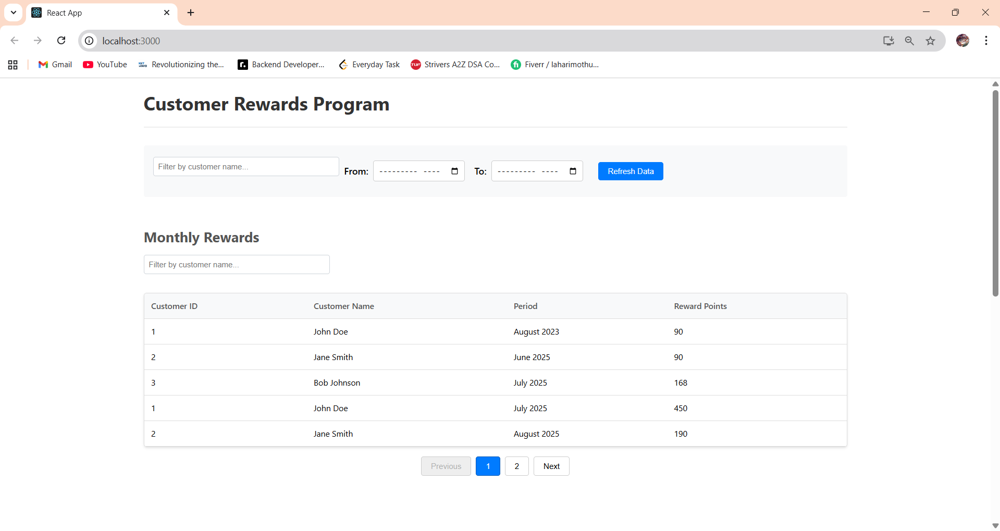
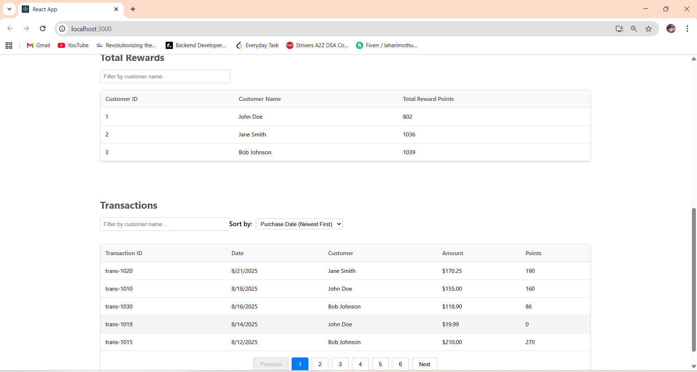

### Test Cases Screenshot
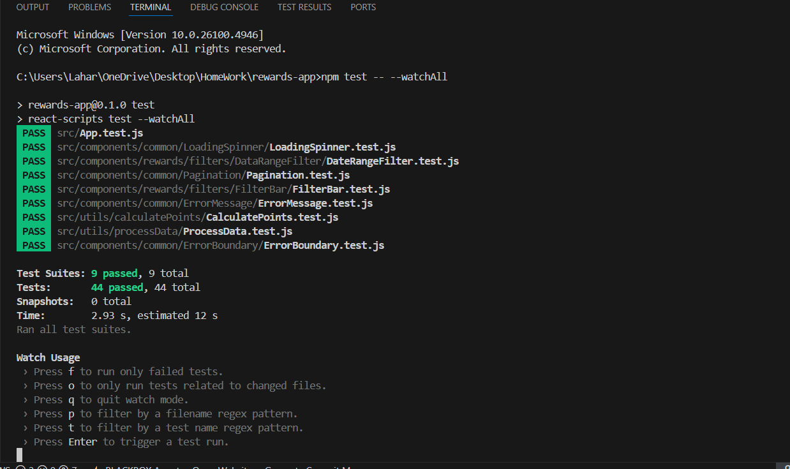
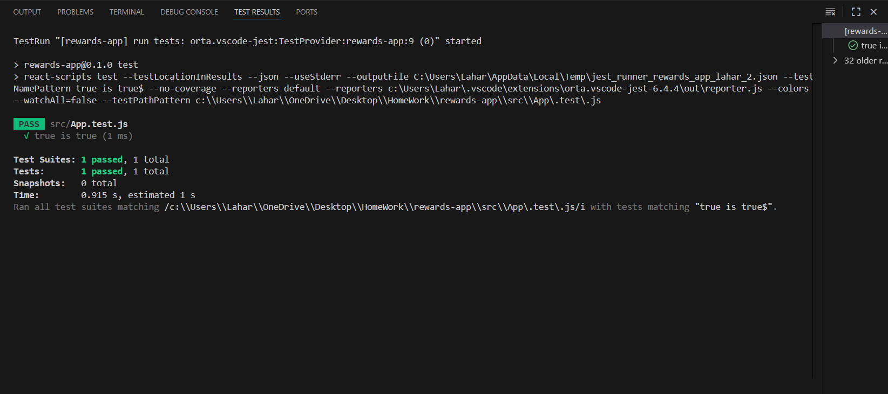
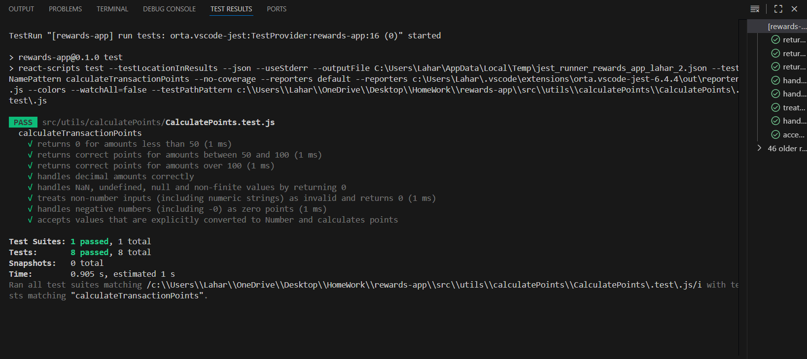
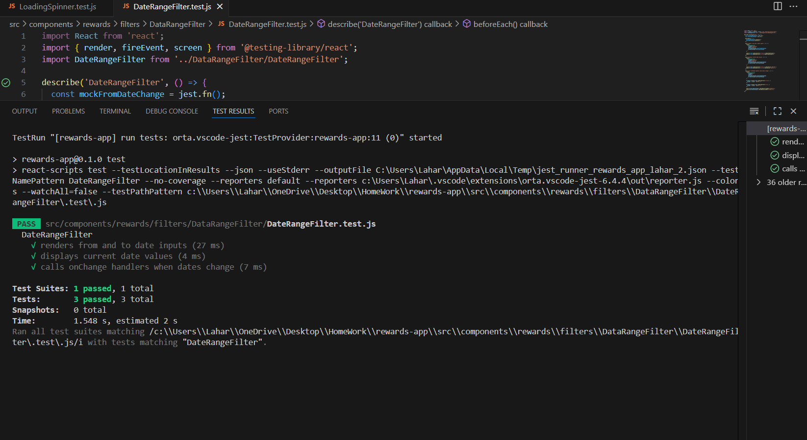
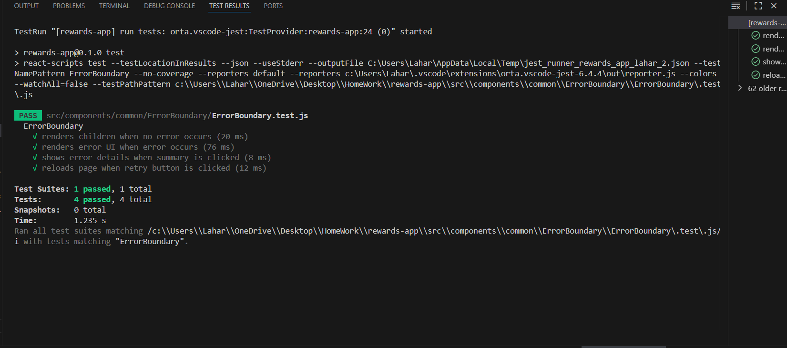
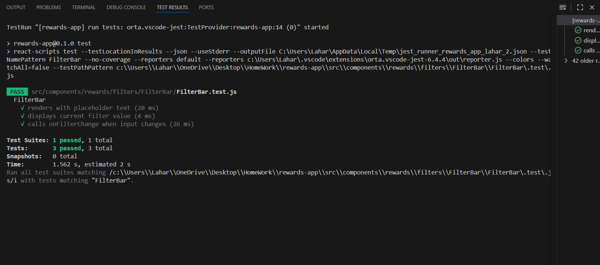
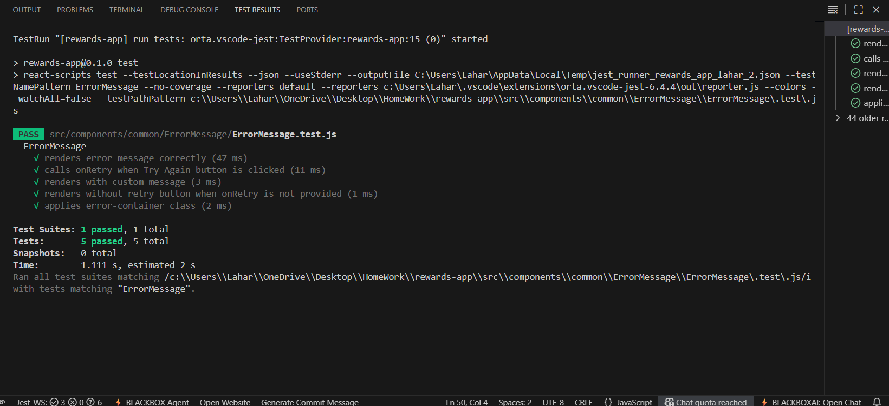
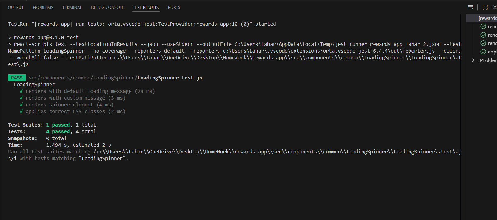
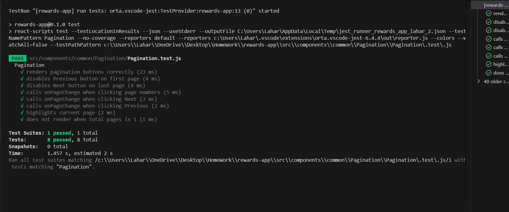
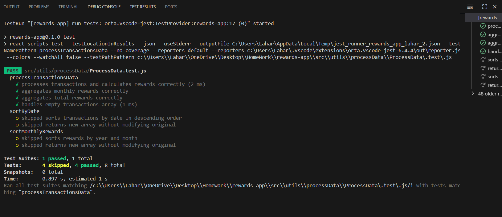
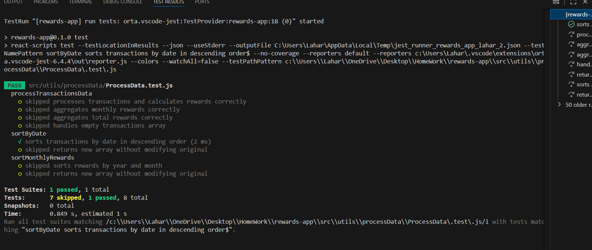
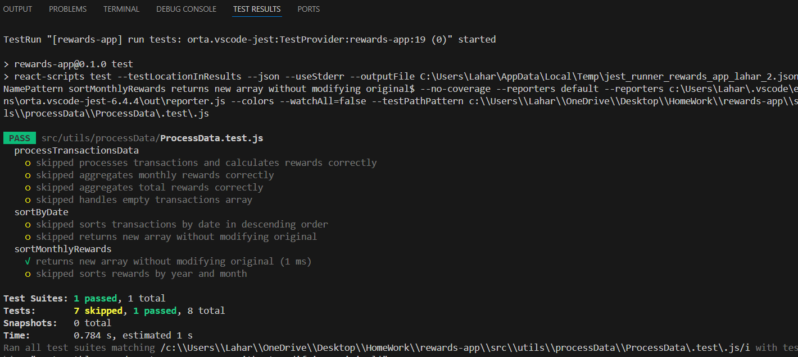
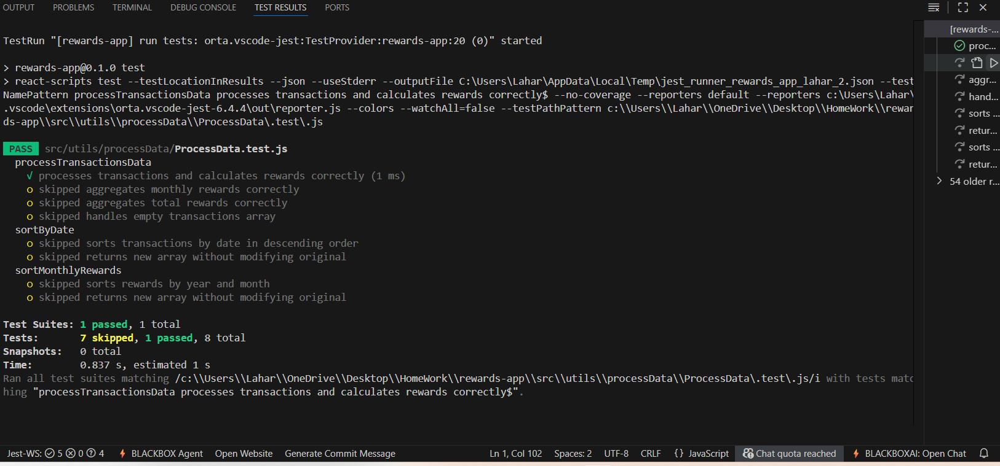    

### Coverage screenshots
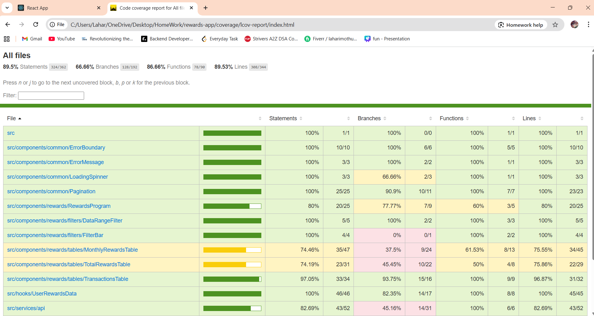
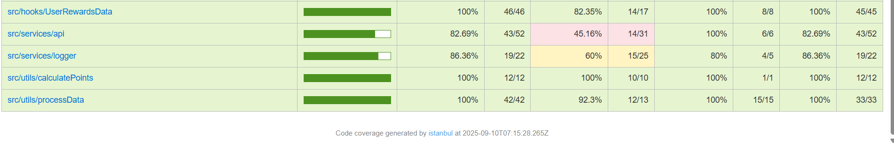
